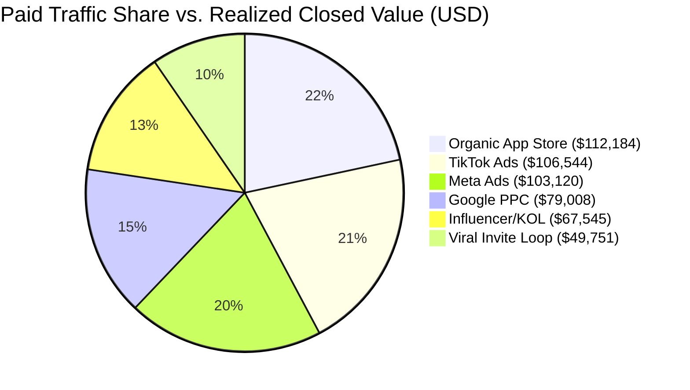
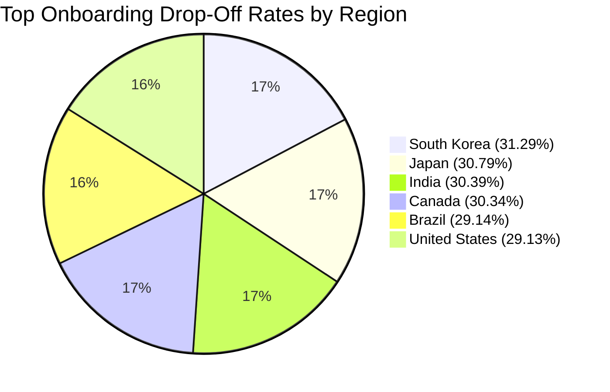
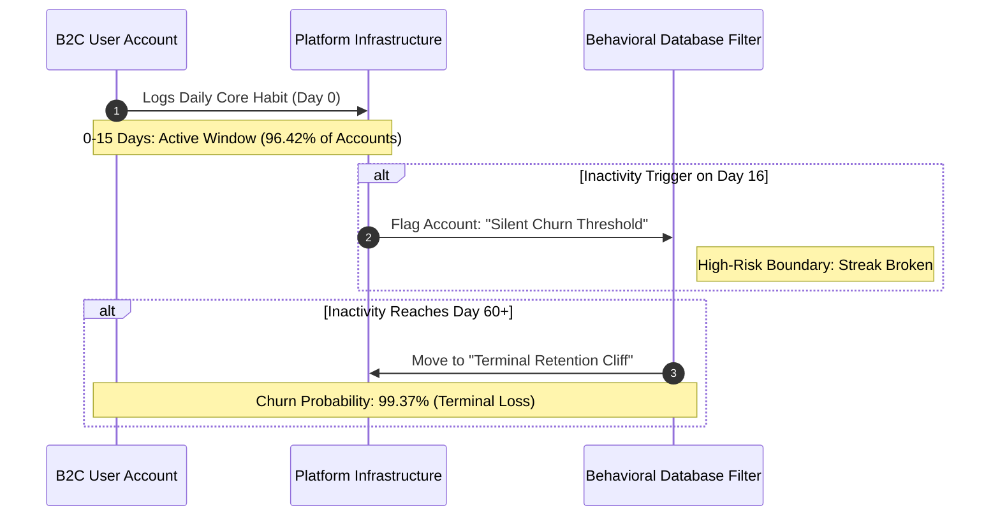
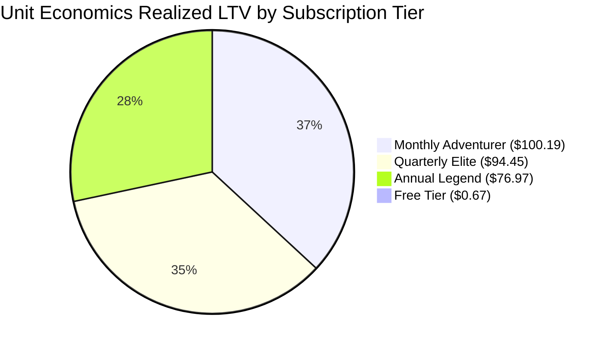

# B2C SaaS Funnel Telemetry & Customer Retention Audit
**Analytical Framework:** Full-Funnel Growth Leakage Architecture Mapping  
**Target Profile:** Executive Leadership (CEO, VP of Growth, Head of Product, Revenue Operations)  
**Maintainer:** Hafsa | Product Analyst and Funnel Strategist

---

## 1. Executive Summary: The Value-Gap

High signup volumes and cheap client acquisition rates are vanity metrics masking critical structural failures within this product ecosystem. This audit isolates severe software bottlenecks, processing drops, and operational bugs that prevent acquired users from achieving their initial value transaction. 

By tracking the lifecycle of individual B2C accounts, the underlying relational database reveals that the platform suffers from massive onboarding activation drops and a continuous, flat monthly attrition pattern.

### Platform Financial Penalty
The platform fails to activate users rapidly and secure long-term retention, resulting in immediate write-offs of acquisition capital and broken subscription renewals. The financial damage breaks down as follows:

| Metric Indicator | Base Volume / Value | Localized Impact | Strategic Impact Tier |
| :--- | :--- | :--- | :--- |
| **Dropped Non-Activated Accounts** | 41.72% of Total Traffic | - | Sunk Infrastructure Load |
| **Wasted Marketing Acquisition Capital (CAC)** | Paid Channels Spend | Heavy Net Capital Loss | Sunk Marketing Capital |
| **Uncaptured Transaction Failures (Gateway)** | High-Value Annual Tiers | \$0.00 Settled Cash | Immediate Revenue Leakage |
| **Free-Tier Margin Strain** | 9,595 Active Users | -\$12.28 Net Loss Per User | Structural Margin Degradation |

---

## 2. Repository Architecture & Deployment

This repository is organized as a production-ready analytical pipeline. The core SQL architecture is modularized within the `scripts/` directory to demonstrate data sanitation, explicit relational joining, and advanced window functions on un-aggregated data streams.

```text
├── README.md                          <-- Comprehensive Executive Report & Documentation
└── scripts/
    ├── 01_database_setup.sql          <-- Database & physical table instantiation
    ├── 02_data_ingestion.sql          <-- Bulk LOAD DATA INFILE & sanitization pipeline
    ├── 03_acquisition_efficiency.sql  <-- Phase 1 Marketing & channel ROAS queries
    ├── 04_churn_diagnostics.sql       <-- Phase 2 & 4 Attrition, VoC, and text mining
    └── 05_predictive_alerts.sql       <-- Phase 3 & 5 Financial engines & automated alerting
```

---

## 3. Funnel Conversion & Onboarding Latency

The data disproves the assumption that a highly gamified, self-serve onboarding interface guarantees rapid user activation. Users drop off in large volumes before logging their initial habit milestone.

### A. Acquisition Funnel Efficiency
An evaluation of inbound channels reveals a stark misalignment between traffic volume and real subscription conversion. Social media pipelines scale volume but degrade baseline conversion quality:

| Inbound Traffic Origin | Total Leads Generated | Total Activated Users | Avg CAC Per User | Onboarding Activation Rate | Realized ROAS |
| :--- | :--- | :--- | :--- | :--- | :--- |
| **Viral Invite Loop** | 1,212 | 1,059 | \$2.82 | **87.38%** | **3.71x** |
| **Organic App Store** | 2,770 | 2,265 | \$0.00 | **81.77%** | **Infinite** |
| **Influencer/KOL** | 1,858 | 1,448 | \$22.04 | **77.93%** | **0.48x** |
| **Google PPC** | 2,198 | 1,590 | \$18.86 | **72.34%** | **0.55x** |
| **Meta Ads** | 3,216 | 2,086 | \$17.06 | **64.86%** | **0.58x** |
| **TikTok Ads** | 3,746 | 2,183 | \$13.28 | **58.28%** | **0.71x** |



### B. Regional Drop-off Constraints
Once an account is registered, the drop-off rate before core funnel activation (`is_activated_core_funnel = 0`) displays localized friction points, identifying potential translation or UI display blockages:



---

## 4. Behavioral Churn & The Frustration Spike

Once users exit the initial onboarding phase, their customer lifetime value is actively degraded by platform instability and fulfillment bugs embedded within the app architecture.

### The 15-Day Momentum Loop
The product operates on a rigid behavioral loop. The graph below outlines the progression an account takes after registering an entry:



### Churn Graph Breakdown
1. **The Active Window (Steps 1–2):** 96.42% of the active population moves cleanly inside a 15-day cycle. As long as a transaction or habit log occurs here, account momentum is sustained.
2. **The Silent Churn Threshold (Steps 3–4):** On Day 16 of inactivity, the user exits the standard behavioral loop. This is a critical product dead zone where the user has quietly abandoned the dashboard, but traditional metrics have not flagged them as lost.
3. **The Terminal Retention Cliff (Steps 5–6):** If inactivity crosses the 60-day mark, the probability of recovery drops below 1%. At this stage, the account hits a permanent retention cliff, resulting in terminal churn.

### Operational Frustration Penalty
*   **The Churn Uniformity:** Our churn volume is flat, consistently bleeding **6% to 7%** of our total subscriber base *every single month* from Month 1 to Month 14. This flat profile indicates a systemic failure to engage users over time.
*   **The Streak-Breaking Crash Tax:** Cross-referencing user reviews with product logs exposes a massive operational issue. Highly dedicated users who logged **300+ habits** are issuing 1-star reviews and churning because application crashes and database sync errors are wiping their 30-day routine milestones to zero.

---

## 5. Foundational Unit Economics Nuances

To maintain absolute credibility, the documentation highlights an anomalous data trend within our checkout infrastructure:



1. **The Inverted Value Curve:** In traditional SaaS, annual accounts deliver the highest LTV because cash is collected upfront. At HabitArcade, **Monthly Adventurer delivers our highest LTV (\$100.19)** and an excellent **8.33x LTV:CAC efficiency ratio**. Meanwhile, the Annual tier underperforms at **\76.97**.
2. **The Checkout Processor Failure:** This inversion happens because our high-value annual transactions are hitting heavy billing processor errors (such as insufficient funds or bank gateway declines). Users trying to buy our highest-priced package are getting blocked by transaction failures, meaning their potential revenue is never captured.
3. **The Customer Support Paradox:** Active users at Month 18 average 1 to 5 customer support tickets, while churned users typically have **zero recorded support tickets**. Support ticket volume is an indicator of highly engaged power users trying to fix their favorite tool. **Silence is our primary churn indicator.**

---

## 6. Strategic Recommendations and Corrective Interventions

To capture and recover our leaked pipeline value and stabilize our flat attrition curve, the platform must transition away from passive interfaces and implement automated behavioral workflows.

### Action 1: Deploy a Day-5 Streak Rescue Notification
*   **The Issue:** Churned users typically fail to clear a 4-day habit streak, indicating early failure points before a routine is built.
*   **The Fix:** Build an automated webhook trigger. If a user’s routine is broken due to a recorded system crash or manual lapse, fire an immediate "Streak Repair Voucher" push notification to restore their progress milestones.
*   **The Impact:** This eliminates loss-aversion frustration, preserving user momentum and preventing early attrition.

### Action 2: Build a Programmatic Churn Warning Trigger
*   **The Issue:** Traditional marketing re-engagement campaigns deploy too late, firing after a user has already uninstalled or deleted the application.
*   **The Fix:** Program a real-time behavioral database filter that flags accounts immediately when their 3-day moving average of habit logging falls below 50% of their historical baseline.
*   **The Action:** Fire a contextual check-in interface prompt or automated support concierge email to intercept the user before they drop off the terminal cliff.

### Action 3: Optimize Gateway Processor Configurations
